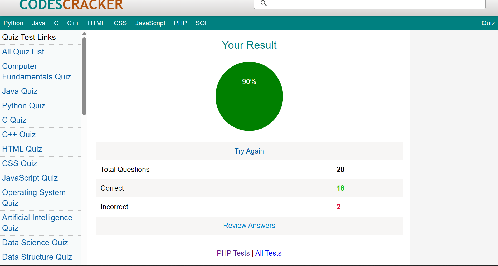
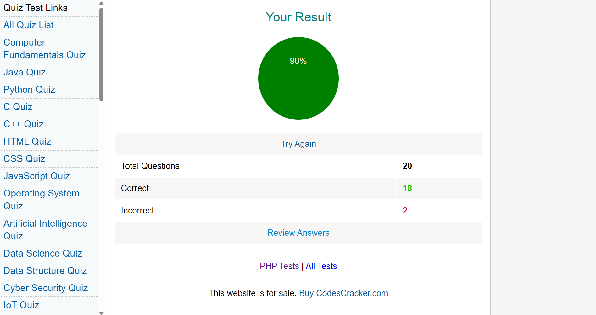
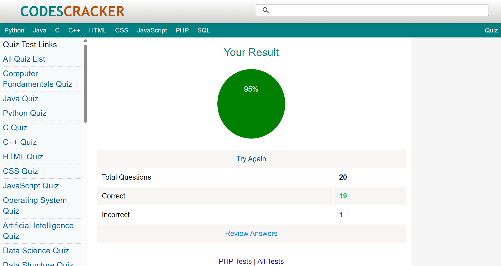
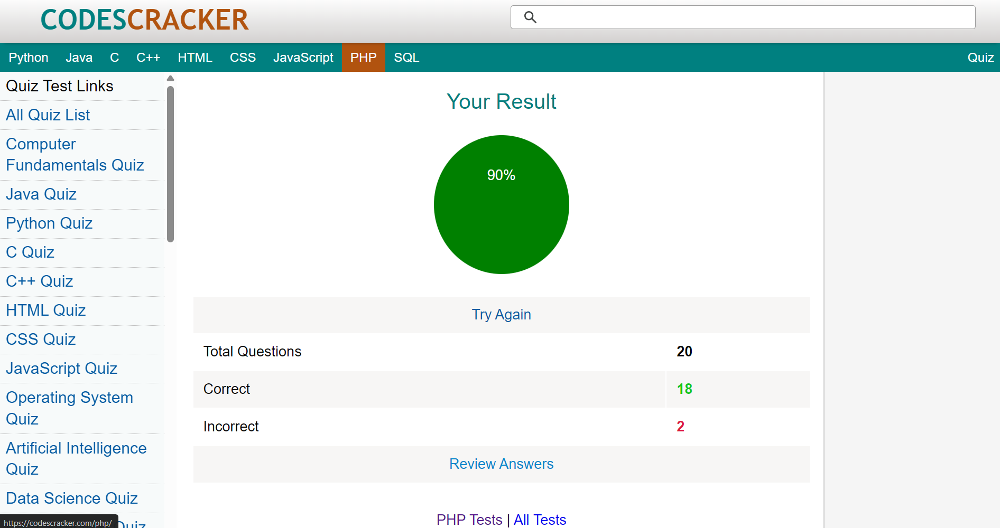

# PHP Modules Assessment

This folder contains assessment artifacts for modules covering **PHP**, **Advanced PHP**, and **Unit Testing**.

## Topics Covered

- Core PHP concepts
- Advanced PHP features
- Unit Testing with PHPUnit

## Assessment

To evaluate these modules, I took tests on **CodeCrackers** covering the concepts mentioned above. The tests were divided into **4 parts**. The results are as follows:

### Test 1

### Test 2

### Test 3

### Test 4


