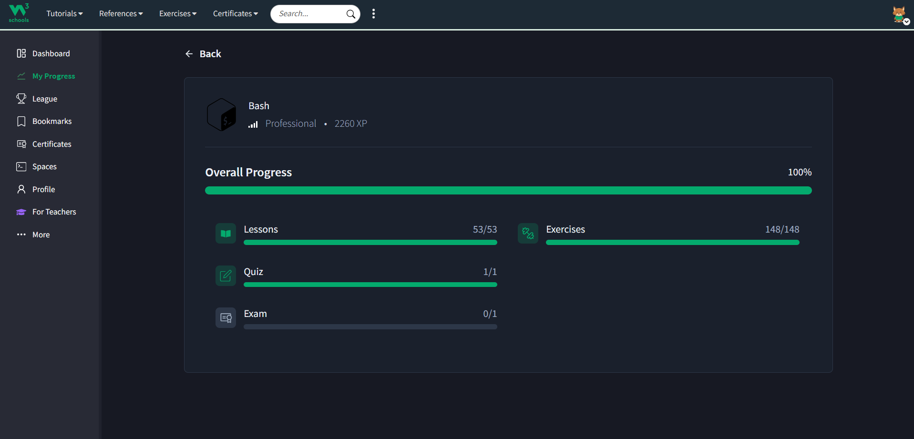
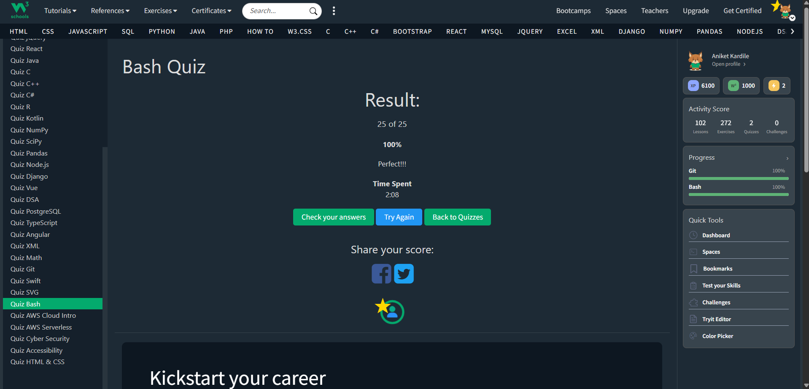

## 📌 Description

This module showcases my learning and assessment progress for Linux commands. It reflects hands-on practice and understanding of command-line operations.

---

## 📊 Assessment Summary

* ✅ Lessons Completed
* ✅ Exercises Completed
* ✅ Quiz Completed
---

## 📎 Proof of Work

### 📘 Overall Progress

### 📝 Quiz Results

---

